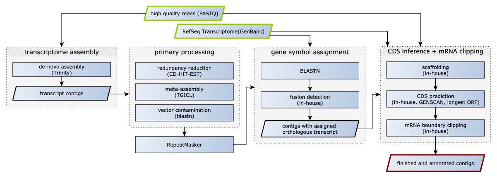

% FRAMA: From RNA-seq data to annotated mRNA assemblies - Manual
% By Martin Bens
% Jan. 3, 2015

# Introduction
**FRAMA** is a transcriptome assembly and mRNA annotation pipeline, which
utilizies external and newly developed software components. Starting with
RNA-seq data and a reference transcriptome, **FRAMA** basically performs 3
steps: de novo transcript assembly (Trinity), gene symbol assignment (best
bidirectional blastn hit) and CDS annotation (multiple sequence alignment,
GENSCAN, ...). Additional characteristics are scaffolding of fragmented
transcript and splitting/clipping of misassembled transcripts.  Clipping of
contig ends is based on evidence from RNA-seq and ortholog information.<br>
Further details: [Unpublished] 



# Input 
Essentially, all you need is a [reference transcriptome in
GenBank](http://ftp.ncbi.nlm.nih.gov/genomes/) format and RNA-seq data in FastQ
format. You can also provide **FRAMA** with orthologs to your reference
transcripts (see 'Configuration' for further information). The additional
orthologous coding sequences are used for CDS inference.

# Dependencies

## General

* Linux
* [GNU parallel](http://www.gnu.org/software/parallel)
* R (3.0.3): CRAN packages: `plyr`, `ggplot2`, `reshape`, `gridExtra`
* Bioconductor packages: `KEGG.db`, `GO.db`, [`annotation`](http://www.bioconductor.org/packages/2.14/data/annotation/)
* Perl (5.10.0; all modules available at CPAN): `BioPerl`,
  `Parallel::ForkManager`, `Bio::Range`, `Set::Intspan`

## Bioinformatic Software

Exclude CD-HIT-EST and TGICL if primary preprocessing is not intended. Also,
set `REPEAT := 0` in order to skip repeat masking (not recommendend).

* mandatory: [Trinity](http://trinityrnaseq.sourceforge.net/#running_trinity), WU-BLAST, [EMBOSS](http://emboss.sourceforge.net), [MAFFT](http://mafft.cbrc.jp/alignment/software), [GENSCAN](http://genes.mit.edu/GENSCAN.html), [bamtools](https://github.com/pezmaster31/bamtools), [bowtie2](http://bowtie-bio.sourceforge.net/bowtie2), [samtools](http://samtools.sourceforge.net/)
* optional: [CD-HIT-EST](http://weizhong-lab.ucsd.edu/cd-hit/), [TGICL](http://compbio.dfci.harvard.edu/tgi/software/), [RepeatMasker](http://www.repeatmasker.org/), SGE/OGE (qsub)

# Installation

Installing **FRAMA** is quick and easy. Download and unpack this repository and
make sure you have permission to execute **FRAMA**. You can add **FRAMA** to your
$PATH or create a symlink to **FRAMA** in one of the directories in $PATH. 

Here is a suggest workflow, which adds *FRAMA* to your `$PATH`:

```
#!bash
unzip FRAMA.zip
cd FRAMA/bin/
chmod a+x FRAMA
PATH=$(pwd):$PATH
export PATH
```

# Run

Make sure all mandatory parameters are specified in the configuration file (see
Configuration section). Then, call **FRAMA** with the appropiate configuration
file.

            FRAMA configuration_file

That's all. In case of aborts, consult logfiles and remove incomplete results.
Rerunning the above command will complete remaining tasks.

Same as above, but shows all called processes.

            FRAMA configuration_file verbose

Start from scratch (removes all created files beforehand).

            FRAMA configuration_file scratch

**FRAMA** uses GNU make as a backbone. Parameters other than `verbose` and
`scratch` (and `full-cleanup`, `cleanup`) are forwarded to make. For example,
the following lists all tasks without executing them.

            FRAMA configuration_file -n

# Cleanup

FRAMA creates a lot of intermediate files. See "output files" for further
information about each file. We provide to two cleaning methods:

            FRAMA configuration_file full-cleanup

This will keep all important files:
* `sequences-mRNA.fasta`,
* `sequences-CDS.fasta`,
* `transcript_catalogue.gbk`,
* `summary*`
* `tables/*`

            FRAMA configuration_file cleanup

additionally keeps:
* `transcripts/`,
* `trinity/`

# Configuration

Take a look at and try to run the provided example file in
`PATH_TO_FRAMA/example/testing.conf` before running **FRAMA** on your own data
set.

This also serves as a template for your custom configuration.

## mandatory variables

The following depends mostly on your `$PATH` variable. Specify path to
**directories**(!) of executables for each program that is not in your `$PATH`.
Otherwise, remove line or leave empty.

        PATH_BAMTOOLS     :=
        PATH_BOWTIE       :=
        PATH_CD_HIT_EST   := /home/user/src/cd-hit/
        PATH_EMBOSS       := /home/user/src/EMBOSS/bin/
        PATH_GENSCAN      :=
        PATH_GENSCAN_MAT  := (point to actual file)
        PATH_MAFFT        := /home/user/src/mafft/
        PATH_PERL         :=
        PATH_REPEATMASKER := 
        PATH_RSCRIPT      := /home/user/src/R/bin/
        PATH_SAMTOOLS     :=
        PATH_TGICL        := 
        PATH_TRINITY      :=
        PATH_WUBLAST      :=
        PATH_XDFORMAT     :=

Store intermediate and final files in specified location. Make sure that enough
space is available to store intermediate output of trinity, blast results, read
alignments, ...).

        OUTPUT_DIR := /data/output

Input reads in fastq format. In case of paired end data, indicate elements of
pair by "R1" and "R2" in filename (Example: `sampleA_R1.fq`, `sampleA_R2.fq`).
All files must be in the same format (one of fastq, fasta, gzipped).

        READ_DIR := /data/reads/

Reference transcriptome in GenBank format as provided by NCBI:<br> 

`http://ftp.ncbi.nlm.nih.gov/genomes/[YOUR_REF_SPECIES]/RNA/rna.gbk.gz`

        REF_TRANSCRIPTOME := /data/human.gb

Specify [taxonomy id](http://www.ncbi.nlm.nih.gov/taxonomy) of species to
assemble. FRAMA connects to NCBI (once) to fetch necessary species information.

        SPEC_TAXID := 458603

We use genome wide annotation packages from
[Bioconductor](http://www.bioconductor.org/packages/2.14/data/annotation/) to
assign functional annotation to the resulting transcript catalogue. Provide
annotation package corresponding to your reference species.

        OPT_ANNOTATION := org.Hs.eg.db

## optional

If you already have extracted mRNA and CDS sequences in fastA format, provide
them to **FRAMA**. Additionally, you can add a repeat (soft) masked fastA of your
reference sequence in order to skip RepeatMasking step.

        REF_TRANSCRIPTOME_FASTA            := /data/human_mRNA.fa
        REF_TRANSCRIPTOME_FASTA_MASKED     := /data/human_mRNA.fa.masked
        REF_TRANSCRIPTOME_FASTA_CDS        := /data/human_cds.fa
        REF_TRANSCRIPTOME_FASTA_CDS_MASKED := /data/human_cds.fa.masked

CDS inference is based on the coding sequence of the orthologous reference
transcript. You can extend the number of orthologs used to infere the
appropriate CDS by providing a table with mappings between orthologous
transcript from different species. The first column must contain accession of
the reference transcript. Add one column for each species you want to use and
use 'NA' to indicate unknown orthologs. Additionally, specify taxonomy ID of
each species in the first line (starting with #, tab separated).  Keep in mind,
that we perform a multiple sequence alignments with all coding sequences.
Therefore, the number of species used will have an influence on runtime.
Additionally, you must provide a fasta file containing all coding sequences
mentioned in table (`ORTHOLOG_FASTA`).

        ORTHOLOG_TABLE := /data/ortholog_table.csv
        ORTHOLOG_FASTA := /data/ortholog_cds.fa

Example content ORTHOLOG_TABLE (also, take a look at exampe/ortholog_table.csv)

        #9606   10090   10116   9615
        NM_130786       NM_001081067    NM_022258       NA
        NM_001198819    NM_001081074    NM_133400       XM_534776
        NM_001198818    NM_001081074    NM_133400       XM_534776 

We keep a note in GenBank output about the ortholog used to annotated CDS.
Please specify the order of columns (0-based) based on `ORTHOLOG_TABLE` to
indicate your prefered order of species in case of multiple equally valid
coding regions. Example:

        SPECIES_ORDER := 0,2,1

Specify preprocessing steps you want to apply to the raw trinity assembly
(space separated list) in prefered order. Possible steps are: `cd-hit` and
`tgicl`.

        ASSEMBLY_PREPROCESS := 

Soft masks repeats in assembly and reference. Set to 0 if you want to skip
repeat masking.

        REPEAT := 1

## Software parameter

!Consult manual for external software!

Number of cpus. This will be used for any software which runs in parallel. 

        OPT_CPUS := 2

If SGE is available (qsub), it will be used for blast jobs. Specify number of
jobs.

        OPT_MAX_SGE := 20

### Trinity
Single end (s) or paired end (pe) reads?

        OPT_READTYPE := s

Consult trinity manual. 

Added automatically: `--no_cleanup`

        OPT_TRINITY   := --JM 10G --seqType fa
        OPT_BUTTERFLY := 

### RepeatMasker

Repeat masking reference/assembly. We will add `-xsmall -par OPT_CPUS`
automatically.

        OPT_REPEAT_REF_TRANSCRIPTOME := -species human -engine ncbi
        OPT_REPEAT_ASSEMBLY          := -species human -engine ncbi

### CD-HIT-EST

Added automatically: `-T OPT_CPUS`

        OPT_CD_HIT_EST := 

### TGICL

Added automatically: `-c OPT_CPUS`

        OPT_TGICL := 

### misassembled contigs

Used to detect fusion transcript. Specify maximum overlap (`-max-overlap`)
between CDS regions (specifically: blast hits by coding sequences of reference
transcriptome), minimum length of alignment (`-min-frac-size`), identity
(`min-identity`) and coverage (`min-coverage`) thresholds.

        OPT_FUSION := -max-overlap 5.0 -min-frac-size 200 -min-identity 70.0
         -min-coverage 90.0

### WU-BLAST

Added automatically: `-wordmask=seg lcmask -topcomboN 3 -cpus 1`

        OPT_WUBLAST_BLASTN := 

### SBH requiremnts

Specify minimum required identity and coverage to consider hit as SBH.

        OPT_SBH := -identity=70.0 -coverage=30.0

### Scaffolding

Specify minimum required identity and contig coverage of blast
hit to consider contig as possible scaffolding fragment.
    
        OPT_FRAGMENTS   := -identity 70.0 -query-coverage 90.0

Specify minimum overlap between fragments in alignment to apply filtering rules
(example: keeps sequence with higher similarity to reference if fragments
differ over 98% in overlap, if overlap exceed 66% of contig length)

        OPT_SCAFFOLDING := -fragment-overlap 66.0 -fragment-identity 98.0

### CDS prediction

Add '-predictions' if you don't want to use predicted coding sequences (XM
Accessions) for CDS inference.  Don't use that if your reference contains "XM"
Accessions [TODO].

        OPT_PREDICTCDS := -predictions

# Output files

## important files

| File                                | Description                                                         |
|------------------------------------|---------------------------------------------------------------------|
| transcript_catalogue.gbk *          | GenBank file describing **all annotated sequences**.                |
| sequences-CDS.fa                    | Fasta with **coding sequences**.                                    |
| sequences-mRNA.fa                   | Fasta with **transcript sequences** (w/o introns; clipped ends).    |
| assembly.fa                         | Repeat masked **trinity assembly**.                                 |
| summary.pdf                         | General overview of transcript catalogue|                           |
| tables/summary.csv                  | Table containing summary for each annotated transcript.             |
| tables/cds.csv                      | CDS coordinates (1-based) on sequences-mRNA.fa.                     |
| tables/annotation.csv               | Contig annotation (contig, refseq, strand, symbol).                 |
|  tables/overview.csv                | Transcript catalogue details .                                      |
| tables/transcriptome_statistic.csv  | Table containing descriptive statistics about transcript catalogoue.|

*mRNA feature instead of 'gene' feature to limit mRNA boundaries in case of misassembled contigs 


### functional annotations (based on reference)

Table containing GO Terms associated with each annotated transcript. Also,
overview of covered GO Terms and genes in total (genes_per_ontology) and in
more detail (genes_per_path).

        tables/gene_ontology.csv
        tables/gene_ontology_genes_per_ontology.csv
        tables/gene_ontology_genes_per_path.csv

Same as above, but for KEGG Pathways.

        tables/kegg.csv
        tables/kegg_covered.csv
        tables/kegg_genes_per_path.csv

## intermediate output

### trinity/

Trinity output (including intermediates).

### transcripts/

Running **FRAMA** creates a lot intermediate output which might come in handy in
downstream analysis. Each transcript assignment is stored in a separate
directory in

        transcripts/

with the naming pattern according to assigned ortholog.

        transcripts/SYMBOL_ACCESSION/

This directory includes the following files:

Result in GenBank format.

        _final.gbk

Raw GENSCAN output.

        CDS_genscan.txt

Assignment of transcript accession to GENSCAN prediction based on blast hits.

        CDS_genscan_annotated.txt

Multiple sequence alignment with orth. species requested in `ORTHOLOG_TABLE`

        CDS_alignment.aln

BLAST databases for reference and assembly.

        db/

BLAST results including average for each HSP-group (`avg_*`) and best hit per query (`best_*`).

        blast/raw_*
        blast/avg_*
        blast/best_*

